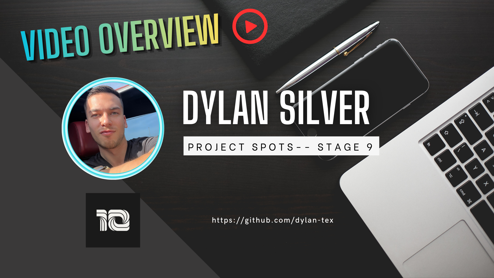
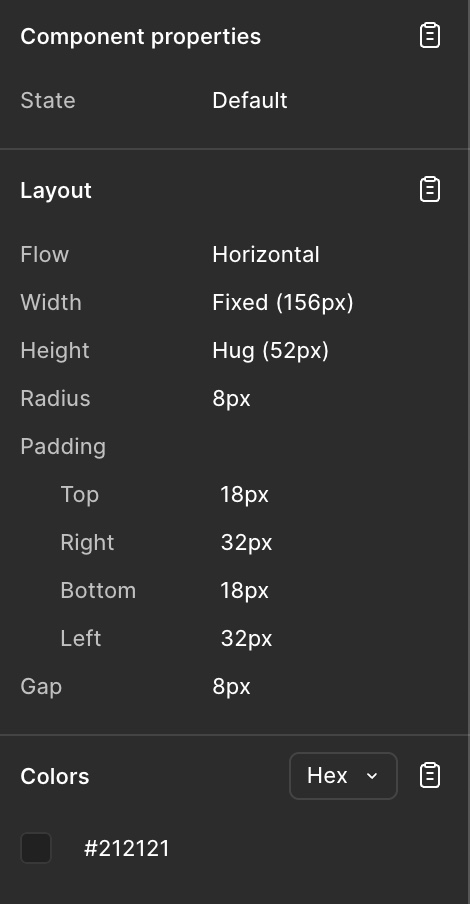
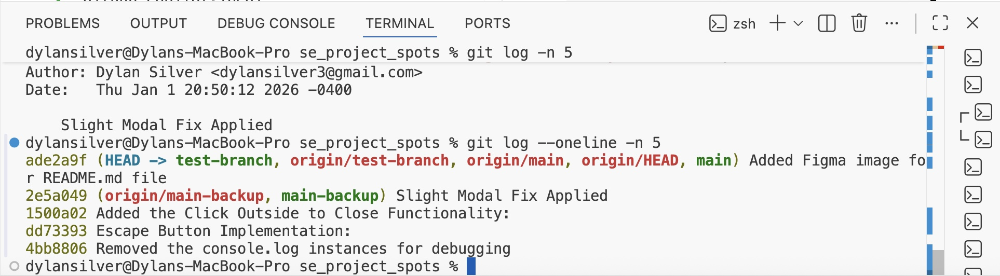
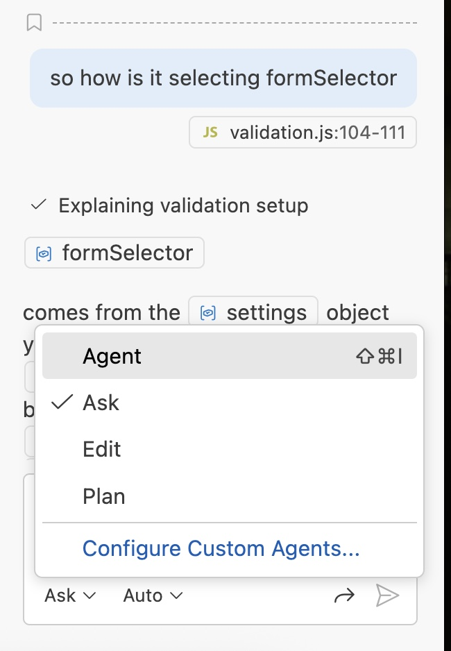

# Project Spots

### Overview

- [Intro](#intro)
- [GitHub Branches](#github-branches)
- [Figma](#figma)
- [BEM Methodology](#bem-methodology)
- [The DOM](#what-is-the-dom)
- [Modal Class](#modal-class)
- [\*\*UPDATE\*\* <u>Validation</u>](#validation)
- [Instructions on Deployment](#instructions-on-deployment)
- [Plans on Improving the Project](#plans-on-improving-the-project)

Check out
[this video](https://vimeo.com/1150901065/e26c0f0d01?share=copy&fl=sv&fe=ci), where I describe my
project and some challenges I faced while building it.

[](https://vimeo.com/1150901065/e26c0f0d01?share=copy&fl=sv&fe=ci)

[Link to my project on Pages](https://dylan-tex.github.io/se_project_spots/)

## Intro

This project made heavy use of JS, the DOM, validation, Figma, advanced Git, and more.

In this most recent update I implemented form validation, added a second JS file for validation, and utilized object declaration to simplify references to classses and selectors rather than relying on object literals.

### GitHub Branches

GitHub branches allow you to test your code while preserving prior versions of it on another branch. Using advance Git commands you can also merge branches, go back to a previous 'commit' and more.

I created three branches in this project and they were:

- main
- main-backup
- test-branch

There were several instances where merge conlflicts came up, and also where I had to overwrite one branch with another.

Overwriting a branch with another has risks, but I found it necessary in some cases.

The code to overwrite one branch with another is:

`git reset --hard origin/test-branch`

followed by

`git push --force-with-lease origin main`

to force push it to the remote repository.

For a full list of useful command in Git, see [GitHub Commands](https://git-scm.com/docs)

### Figma

This was the Figma file used to model the project. Understanding how to interpret Figma continued to play a major role in this project.

- [Link to the project on Figma](https://www.figma.com/file/jFtXsDr4XOyebKcgjyXN6W/Sprint-6-Project%3A-Spots?type=design&mode=design&t=mOmexgRdnrmMll3T-0)

- Using the `option` key to find distances between parts of the layout
- Identifying fonts, layouts, and colors from the Figma utilizing the properties panel, seen below:



This project also made use of responsive design for mobile devices, deploying code such as the following:

```
@media screen and (max-width: 672px) {
  .profile {
    display: flex;
    flex-direction: column;
    max-width: 288px;
    align-items: center;
    text-align: center;
    padding-top: 20px;
  }

  .profile__avatar {
    height: 80px;
    width: 80px;
    margin-bottom: 12px;
    margin-right: 0;
  }
  ...
}
```

### BEM Methodology

"Block Element Modifier" Metholodgy helps developers navigate through each others' code.

### What is the DOM?

The DOM is the Document Object Model where by objects are instances of classes and javascript can manipulate these objects to change the result to the user. This allows much greater flexibility with handling using input and allows for much more efficient code.

### Modal Class

The objects of the modals class where regulary referenced through DOM integration.

An example of this is the openModal function in our JS, seen below, which is passed a modal object declared in the JS. It adds the class 'modal_is-opened' to dynamically adjust the appearance of the modal on the page.

```
function openModal(modal) {
  // Add a class to indicate the modal is opened.
  modal.classList.add("modal_is-opened");
}
```

## Validation

Validation was used in this project to ensure that users were inputting the correcting information into the modals.

Also, we wanted to ensure that the New Post Modal was not being used to create empty cards.

```
// Form Validation Script
const enableValidation = (config) => {
  const formlist = document.querySelectorAll(config.formSelector);

  formlist.forEach((formEl) => {
    setEventListeners(formEl, config);
  });
};
```

The config is an object we declared, settings, which references modifiers and classes that are used in conjunction with modals.

Here's the settings declaration:

```
const settings = {
  formSelector: ".modal__form",
  inputSelector: ".modal__input",
  submitButtonSelector: ".modal__submit-btn",
  inactiveButtonClass: "modal__submit-btn_disabled",
  inputErrorClass: "modal__input_type_error",
  errorClass: "modal__error",
};
```

## Instructions on Deployment

I would highly suggest a thorough review of Figma. Specifically the use ot the `options` key (on macs) to determine spacing between elements.

There are many tutorials on Figma. Here is one such example:

[Figma YouTube Tutorial](https://www.youtube.com/watch?v=To_ADCVSg5g)

Make sure that you are utilizing branches because if one branch becomes corrupted you can have a backup branch.

Utilizing the terminal and Git to revert a commit or even go back to a specific commit (a prior version of the code) may be esential if you find the code broken.

Here is the command to go back to a specific commit, shoudl you need it:

`git reset --hard <commit-hash>`

where the commit has is the 7 digit number seen before each commit below:



Also-- there are some AI functions built into Visual Studio code as extensions which can help you identify solutions quicker than on your own.

One tool is GitHub Copilot which users can implement with varying degrees of impact on the project itself. There are several different modes users can work with.



## Plans on Improving the Project

The profile photo of the user -- which is not current chosen by the user-- could be changed.

In a future version of the project, the user could be prompted to take a photo of themselves on their device, or upload a photo.
