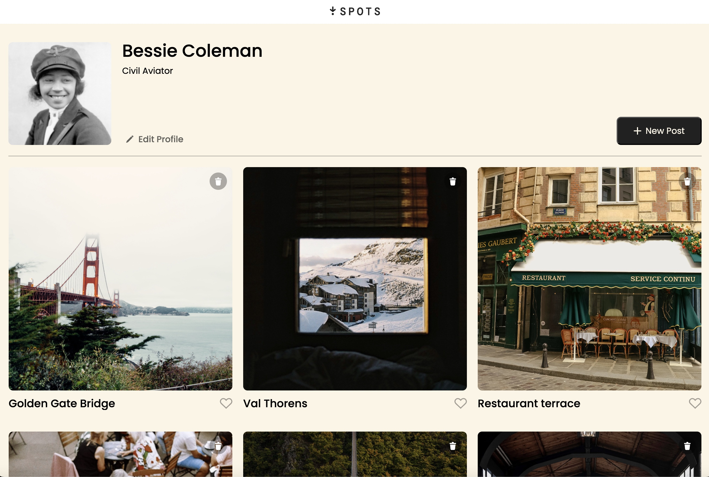

# Project Spots

Spots is a responsive photo-sharing application where users can manage a profile and interact with image cards. The final version connects to the TripleTen API so profile updates and card interactions persist on the server.

## Live Project

[Open the deployed project](https://dylan-tex.github.io/se_project_spots/)

[](https://dylan-tex.github.io/se_project_spots/)

## Features

- Load the user profile and initial cards from the API when the app starts
- Edit the profile name and description with a server-backed request
- Update the profile avatar with a server-backed request
- Create image cards that receive server-generated IDs
- Open image previews in a modal
- Like and remove likes from cards with server-backed requests
- Delete cards through a confirmation modal
- Validate profile, avatar, and new-post forms before submission
- Provide loading text and error logging for API-driven form submissions
- Support responsive desktop and mobile layouts based on the Figma design

## Technologies

- HTML5
- CSS3 with BEM naming conventions
- JavaScript (ES6 modules)
- Webpack
- REST API requests with `fetch`
- Git and GitHub Pages

## Design

The interface was implemented from the [Spots Figma design](https://www.figma.com/file/jFtXsDr4XOyebKcgjyXN6W/Sprint-6-Project%3A-Spots?type=design&mode=design&t=mOmexgRdnrmMll3T-0).

## Project Pitch Videos

- [Part 1: Spots](https://www.youtube.com/watch?v=q57LHM8_KTM)
- [Final Stage: API Interactions](https://drive.google.com/file/d/1m2vvW1oY9Y23zwPNuFPch2XMqE07cKlz/view?usp=sharing)

[](https://drive.google.com/file/d/1m2vvW1oY9Y23zwPNuFPch2XMqE07cKlz/view?usp=sharing)

## Running Locally

Install dependencies and start the development server:

```bash
npm install
npm run dev
```

Create a production build with:

```bash
npm run build
```

## API Integration

The application uses the TripleTen REST API with `fetch` requests. Profile details, the avatar, cards, likes, and card deletions are saved on the server, so completed changes remain after the page reloads. Form submissions show loading text while requests are in progress and log errors if a request fails.

## Future Improvements

- Allow users to upload image files instead of supplying image URLs.
- Display user-friendly request errors in the interface.
- Add card ownership rules so users can delete only their own cards.
